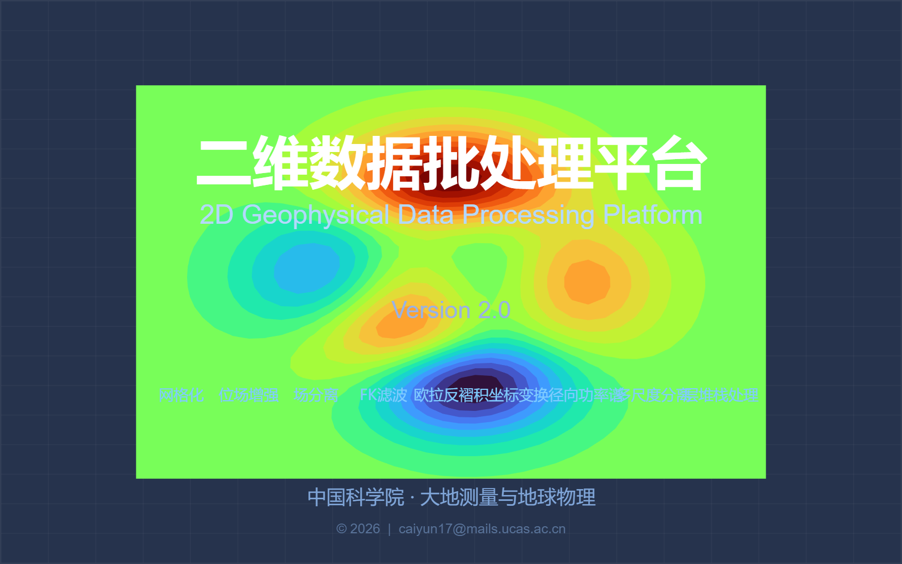
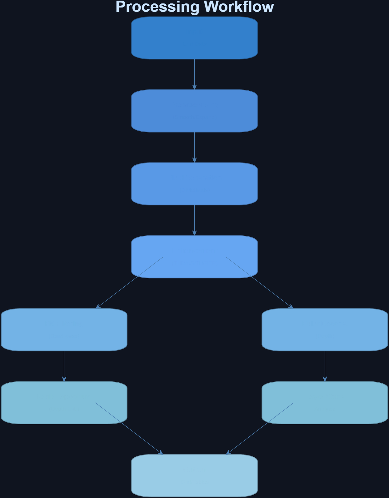

# Geophysical 2D Data Processing Platform

[](https://www.mathworks.com/)
[](https://github.com/ewencai/Geophysical2dDataProcessingPlatform/releases)

**2D geophysical potential-field data processing platform** — 28 function modules covering gridding, enhancement, field separation, spectral analysis, normalization, coordinate transformation, and layer-stack processing for gravity and magnetic data.



## Overview

A comprehensive batch-processing GUI for 2D gridded potential-field data. All operators are pure-function `+ops` package members callable headlessly or through the GUI. Features automatic input-mode switching, multi-output support, cross-session persistence, and unified frequency-domain wavenumber conventions.

### Design Principles

- **Pure-function operators**: Each `+ops` function takes `(G, params)` → returns `G`. Callable headlessly in pipelines.
- **Auto input-mode switching**: `grid` / `scatter` / `dualGrid` / `stack` — the GUI rebuilds input panels accordingly.
- **Multi-output**: Multi-scale separation, normalization-to-reference etc. produce multiple outputs; preview dropdown lets you switch.
- **Cross-session persistence**: All inputs auto-saved to `appState.json`, auto-restored on next launch.

## Features (28 Modules)

### Gridding
- **Scatter interpolation (14 methods)**: 5 MATLAB built-in + 9 Surfer methods (Kriging, IDW, minimum curvature, RBF, modified Shepard, natural neighbor, triangulation, moving average, local polynomial)

### Grid Math
- **Gaussian smoothing**: NaN-aware 2D separable Gaussian kernel convolution
- **Detrend**: Least-squares polynomial surface removal (1st/2nd order)

### Potential-Field Enhancement
- **Upward continuation**: Frequency-domain `exp(-|k|·h)` operator
- **Vertical derivative**: `|k|^n` enhancement, n=1 or 2
- **Multi-method enhancement (8 methods)**: Horizontal derivative X/Y, Total Horizontal Derivative (THD), Analytic Signal (AS), Tilt angle, TDX (Tilt horizontal gradient), Reduction to Pole (RTP), Downward continuation
- **Euler deconvolution**: Sliding-window source depth inversion (SI 0–3, Reid et al. 1990)

### Field Separation (9 methods)
- Difference of Gaussian (DoG), Upward continuation, Matched filter, Interpolation cutting, Wavelet (DWT sym4), Dual-tree complex wavelet (DTCWT), Variational mode decomposition (VMD 2D), CEEMDAN, Least-squares (polynomial fit)
- **Multi-scale separation**: Two-stage cascade + parallel stripping with configurable scale lists, optional `parfor` acceleration

### Grid Tools
- **2D Pull-back correction**: Directional leaky integration with damping
- **Directional derivative**: Frequency-domain `|k|^n` in x/y/z/total gradient
- **FK wavenumber-domain filtering**: Radial bandpass with cosine taper (physical wavenumber rad/m)
- **Radial power spectrum**: Spector & Grant (1970) depth estimation (`ln P` vs `k`)
- **Grid integration**: 1D cumulative / 2D window (rectangular/trapezoidal/Simpson)
- **Grid expand**: Edge padding with sync of geo-headers
- **Format conversion**: ASC ↔ GRD ↔ MAT ↔ XYZ

### Normalization
- **Self-normalization**: Linear (min-max) / Robust (percentile) / Anchor (piecewise with auto inflection detection)
- **GRD threshold analysis**: Histogram + polynomial fit + derivative root-finding for auto-anchor detection
- **Normalize to reference**: Map distribution B → distribution A with piecewise linear mapping

### Grid Operations (dual-input)
- **Time-lapse differencing**: `B − A` with grid geometry validation
- **Spectral norm matching**: Optimal scaling factor minimizing `||A − αB||₂`

### Layer Stack Processing
- **Layer difference**: Adjacent depth slices → `∂f/∂z` approximation
- **Along-layer extraction**: Vertical linear interpolation at horizon depth
- **Layer-stack averaging**: Thickness-average / weighted average between top/bottom horizons

### Coordinate Transformation
- **Grid rotation**: Rigid rotation about data center with re-interpolation
- **7-parameter coordinate transform**: Bursa-Wolf + Gauss-Kruger projection (via `Par.txt`)

### Utilities
- **White clip**: Polygon (`inpolygon`) masking, keep interior or exterior
- **Grid expand**: `padarray` with geo-header sync

## System Requirements

| Component | Requirement |
|-----------|-------------|
| OS | Windows 10/11 (64-bit) |
| Runtime | MATLAB Runtime R2026a |
| Surfer (optional) | Golden Software Surfer 13+ for advanced gridding |
| Memory | 8 GB recommended |

## Documentation

| Document | Content |
|----------|---------|
| [用户手册 (User Manual)](docs/用户手册.md) | Full mathematical principles, formulas, and parameter reference for all 28 modules (§4), Headless CLI API, wavenumber conventions, error handling |
| [操作手册 (Operations Guide)](docs/操作手册.md) | Quick-start (5 min), UI walkthrough, step-by-step operations for 4 input modes, typical workflow scenarios, parameter cheat sheet, glossary, troubleshooting |
| [安装说明 (Installation Guide)](docs/安装说明.md) | System requirements, license activation, toolbox dependencies, Surfer COM setup |
| [代码说明 (Developer Guide)](docs/代码说明.md) | Code organization, package structure, operator contracts, command-line usage |

## Workflow

```
Scatter → Grid → Smooth → Upward Continuation → Enhancement (THD/Tilt) → Euler Deconvolution
                                  │
                                  ├→ FK Filter → Spectral Analysis
                                  │
                                  └→ Field Separation → Multi-scale → Layer Stack
```



## Headless CLI Usage

```matlab
addpath('Geophysical2dDataProcessingPlatform')

% Read → Process → Write pipeline
G = core.gridRead('bouguer.asc');
G = ops.opUpward(G, struct('height', 1000));
G = ops.opGridDeriv(G, struct('direction', 'z', 'order', 1));
core.gridWrite(G, 'processed.asc');

% Batch processing
core.batchRun('./input/', '*.asc', './output/', @ops.opSmooth, struct('sigma', 3));

% Dual input
core.batchRunDual('./time1/', './time2/', '*.asc', './diff/', @ops.opTimeLapse, struct());

% Layer stack
core.batchRunStack('./slices/', '*.asc', './layers/', @ops.opLayerDiff, struct());
```

## Output Formats

| Format | Extension | Description |
|--------|-----------|-------------|
| Esri ASCII | `.asc` | ArcInfo text grid, N→S row order |
| Surfer DSAA | `.grd` | Surfer 6 text grid, S→N row order |
| MAT | `.mat` | Grid struct `(z, ncols, nrows, xll, yll, cellsize, nodata, name)` |
| XYZ | `.xyz` | 3-column `X Y Z`, NaN rows skipped |

## Wavenumber Convention

All frequency-domain operators share a unified wavenumber computation (`+ops/wavenum.m`):

$$k_x = \frac{2\pi}{n_x \cdot d} \cdot \text{fftAxis}(n_x), \quad k_y = \frac{2\pi}{n_y \cdot d} \cdot \text{fftAxis}(n_y), \quad |k| = \sqrt{k_x^2 + k_y^2}$$

The radial wavenumber **already includes 2π** (rad/m). Wavelength-to-wavenumber conversion: `k = 2π / λ`.

## Parameter Cheat Sheet

| Operator | Key Parameter | Starting Point |
|----------|---------------|----------------|
| Scatter interpolation | method / cellsize / radius | `kriging` / `0`(auto) / `0` |
| Gaussian smooth | sigma | 1–3 |
| Upward continuation | height (m) | 500–2000 |
| Field enhancement | method / inc / dec | `THD` |
| Euler deconvolution | si / window | 1 / 10 |
| Field separation | method / scale | `DoG` / 5 |
| FK filter | klow / khigh / taper (rad/m) | λ-dependent; taper=0.2 |
| Radial spectrum | nBins | 50 |
| Normalization | method / outMin / outMax | `linear` / -1 / 1 |

---

*24 colormaps · NaN-safe frequency-domain operators · Batch failure isolation · Full cross-session state persistence.*
